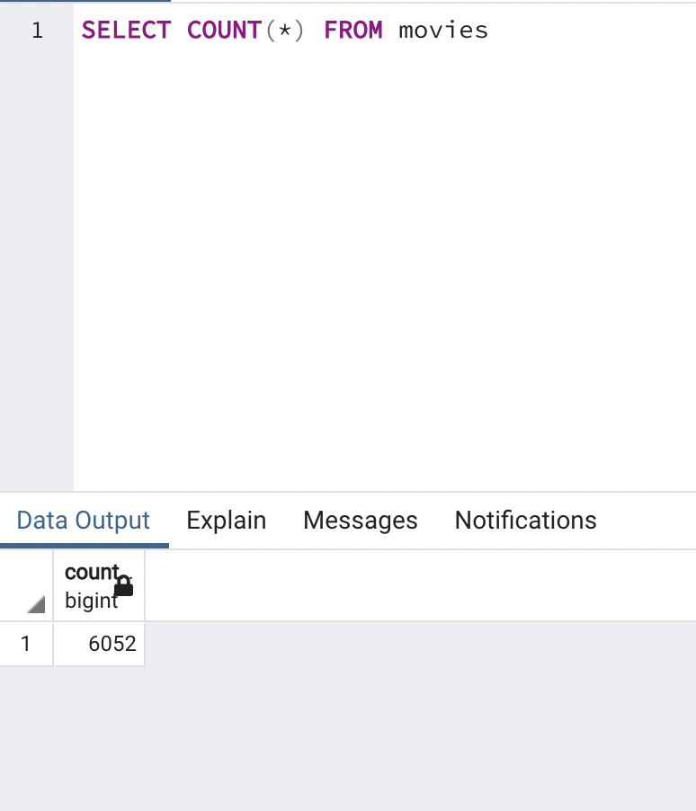
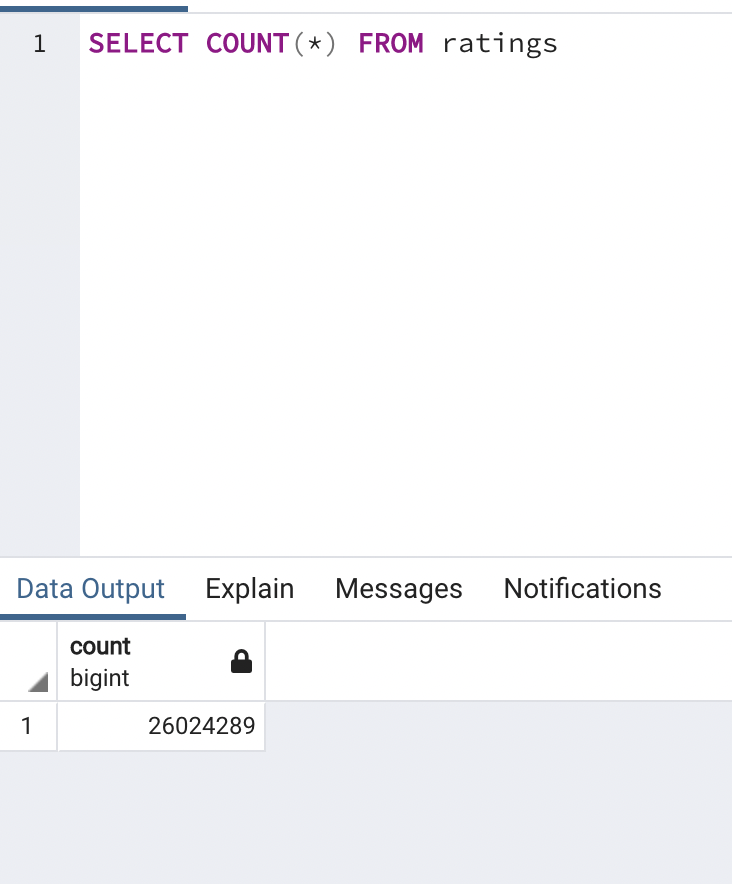

# Movies - ETL Analysis

## Overview of the Analysis 
Amazing Prime Video is a platform for streaming movies and TV shows on Amazing Prime, the world's largest online retailer. 
The Amazing Prime video team wanted to develop an algorithm to predict which low budget movies being released will become popular so that they can buy the streaming rights at a bargain. 

To inspire the team, have some fun and connect with the local coding community, Amazing Prime has decided to sponsor a hackathon by providing a clean data set of movie data and asking participants to predict the popular pictures. 

Britta, a member of the Amazing Prime Video team asked for help with creating the datasets for the hackathon.

There are two data sources: a scrape of Wikipedia for all movies released since 1990, and rating data from the Movie Land's website. 

She needed to extract the data from the two sources, transform it into one clean data set, and finally load the data set into a SQL data base. 

Britta needed to gather data from both Wikipedia and Kaggle, combine them, and save them into a SQL database so that the hackathon participants have a nice, clean dataset to use. To do this, the ETL process was used: extracted the Wikipedia and Kaggle data from their respective files, transformed the datasets by cleaning them up and joining them together, and loaded the cleaned dataset into a SQL database.

The view the raw data from Wikipedia and Kaggle, please see the following files: 
* From Wikipedia: [wikipedia_movies](Resources/wikipedia_movies.json)
* From Kaggle: [movies_metadata](Resources/movies_metadata.csv)
* From MovieLens: [ratings](Resources/ratings.csv)

To view how the data sets were initially cleaned, transformed into databases and saved into SQL database, please see [Wiki_MovieLens_ETL](Wiki_MovieLens_ETL.ipynb)

Amazing Prime loved the dataset and wants to keep it updated on a daily basis. Now, Britta needs help to create an automated pipeline that takes in new data, performs the appropriate transformations, and loads the data into existing tables. The old code needs to be refactored to create one function that takes in the three files—Wikipedia data, Kaggle metadata, and the MovieLens rating data—and performs the ETL process by adding the data to a PostgreSQL database.

## Wrote an ETL Function to Read Three Data Files
Used knowledge of Python, Pandas, the ETL process, and code refactoring to write a function that reads in the three data files and created three separate DataFrames.

Please see [ETL_function_test](ETL_function_test.ipynb) for how this was done. 

## Extracted and Transformed the Wikipedia Data 
Extracted and transformed the Wikipedia data to be merged with the Kaggle metadata. While extracting the IMDb IDs using a regular expression string and dropping duplicates, used a try-except block to catch errors.

Please see [ETL_clean_wiki_movies](ETL_clean_wiki_movies.ipynb) for how this was done. 

## Extracted and Transformed the Kaggle Data
Extracted and transformed the Kaggle metadata and MovieLens rating data, then converted the transformed data into separate DataFrames. Then, merged the Kaggle metadata DataFrame with the Wikipedia movies DataFrame to create the movies_df DataFrame. Finally, merged the MovieLens rating data DataFrame with the movies_df DataFrame to create the movies_with_ratings_df.

Please see [ETL_clean_kaggle_data.ipynb](ETL_clean_kaggle_data.ipynb) for how this was done. 

## Created the Movie Database
Added the movies_df DataFrame and MovieLens rating CSV data to a SQL database.

Please see [ETL_create_database](ETL_create_database.ipynb) for how this was done. 

See below for total movies_df rows in SQL. 

See below for total ratings rows in SQL. 

